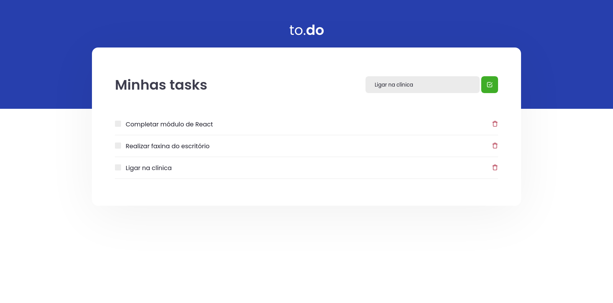

# Desafio 01 - Conceitos do React


> *Obrigado a Rocketseat :rocket: pela imagem acima!*

### 🗒️ Sobre o desafio

Nesse desafio, você deverá criar uma aplicação para treinar o que aprendeu até agora no ReactJS

Essa será uma aplicação onde o seu principal objetivo é uma pequena aplicação de atividades a fazer, para treinar um pouco mais sobre manipulação do estado no React.

**A aplicação deve ser capaz de:**

- Adicionar uma nova tarefa
- Remover uma tarefa
- Marcar e desmarcar uma tarefa como concluída

### :paintbrush: Template da aplicação

https://github.com/rocketseat-education/ignite-template-reactjs-conceitos-do-react

### :man_technologist: Comandos para execução

```bash
  # Instalar dependências
  yarn install

  # Iniciar aplicação
  yarn dev

  # executar testes
  yarn test
```

### :camera_flash: Screenshot da resultado



> Design da aplicação feito pela Rocketseat! :rocket:
